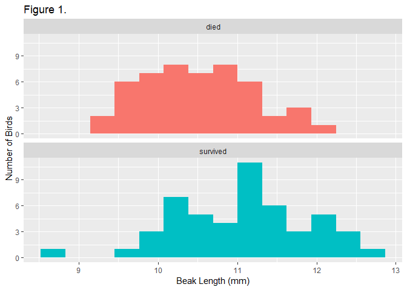

Analyzing Finch Data
================

Load Packages
-------------

Loading the packages necessary for the sript to run

``` r
library(readxl)     # load readxl, for reading Excel files
library(tidyverse)  # load tidyverse, for working with datasets
```

    ## -- Attaching packages -------------- tidyverse 1.2.1 --

    ## v ggplot2 3.1.0       v purrr   0.3.0  
    ## v tibble  2.0.1       v dplyr   0.8.0.1
    ## v tidyr   0.8.2       v stringr 1.4.0  
    ## v readr   1.3.1       v forcats 0.4.0

    ## -- Conflicts ----------------- tidyverse_conflicts() --
    ## x dplyr::filter() masks stats::filter()
    ## x dplyr::lag()    masks stats::lag()

Read Finch Data
---------------

Reading the Finch Dataset

``` r
finches <- read_excel("finches_data.xlsx")
```

See all variables in the dataset
--------------------------------

Glimpse the Finch Data Set

``` r
glimpse(finches)
```

    ## Observations: 100
    ## Variables: 12
    ## $ band             <dbl> 9, 12, 276, 278, 283, 288, 293, 294, 298, 307...
    ## $ species          <chr> "Geospiza fortis", "Geospiza fortis", "Geospi...
    ## $ sex              <chr> "unknown", "female", "unknown", "unknown", "m...
    ## $ first_adult_year <dbl> 1975, 1975, 1976, 1976, 1976, 1976, 1976, 197...
    ## $ last_year        <dbl> 1977, 1977, 1977, 1977, 1977, 1977, 1977, 197...
    ## $ outcome          <chr> "died", "died", "died", "died", "died", "died...
    ## $ weight           <dbl> 14.50, 13.50, 16.44, 18.54, 17.44, 16.34, 15....
    ## $ wing             <dbl> 67.00, 66.00, 64.19, 67.19, 70.19, 71.19, 67....
    ## $ tarsus           <dbl> 18.00, 18.30, 18.47, 19.27, 19.27, 20.27, 17....
    ## $ beak_length      <dbl> 9.20, 9.50, 9.93, 11.13, 12.13, 10.63, 9.93, ...
    ## $ beak_depth       <dbl> 8.3, 7.5, 8.0, 10.6, 11.2, 9.1, 9.5, 10.5, 8....
    ## $ beak_width       <dbl> 8.1, 7.5, 7.6, 9.4, 9.5, 8.8, 8.9, 9.1, 8.2, ...

Histogram
---------

Creating histogram for beaklength, grouped by survival with labels

``` r
ggplot(
  data = finches,                     # use the finches dataset
  mapping = aes(x = beak_length,      # put beak length on the x axis
                fill = outcome)       # fill sets the color of the boxes
) +
  geom_histogram(bins = 14) +         # add the histogram, use 14 bins
  facet_wrap(~ outcome, ncol = 1) +   # outcome is the grouping variable
  guides(fill = FALSE) +              # don't show a legend for fll color
  labs(
    title = "Figure 1.",              # title
    x = "Beak Length (mm)",           # x-axis label
    y = "Number of Birds"             # y-axis label
  )
```


